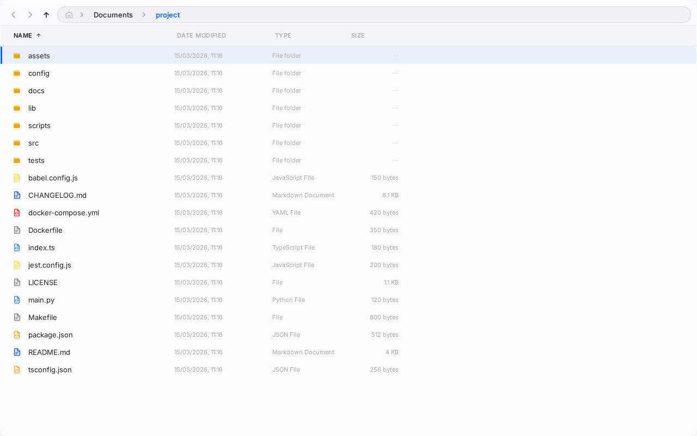
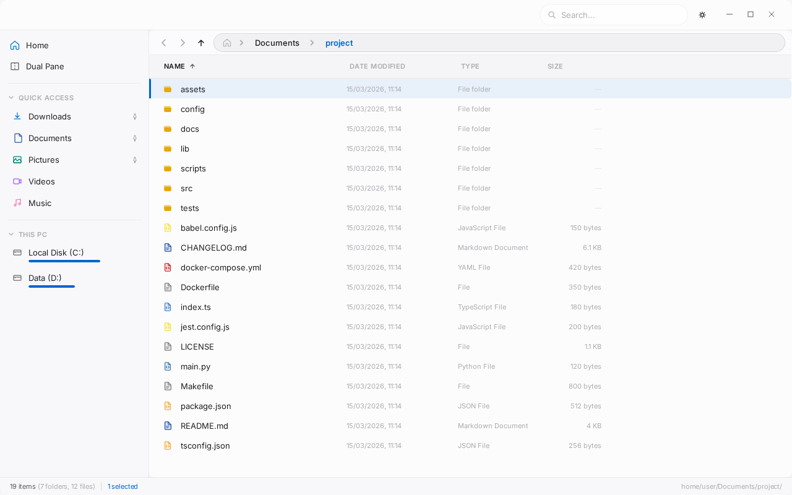
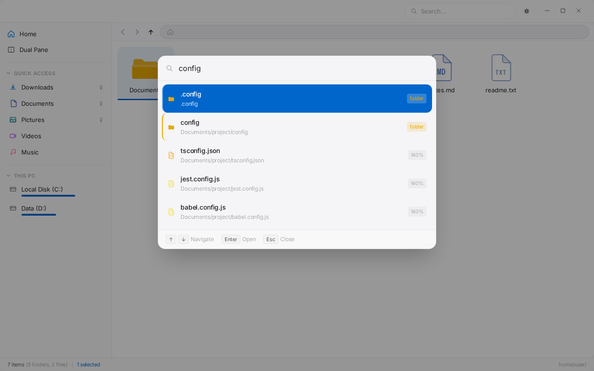
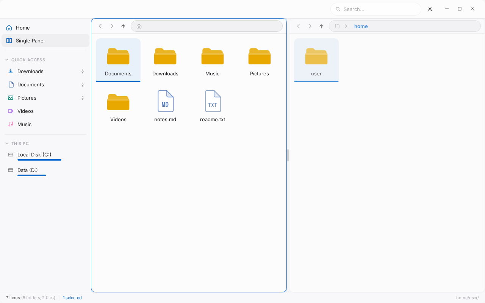
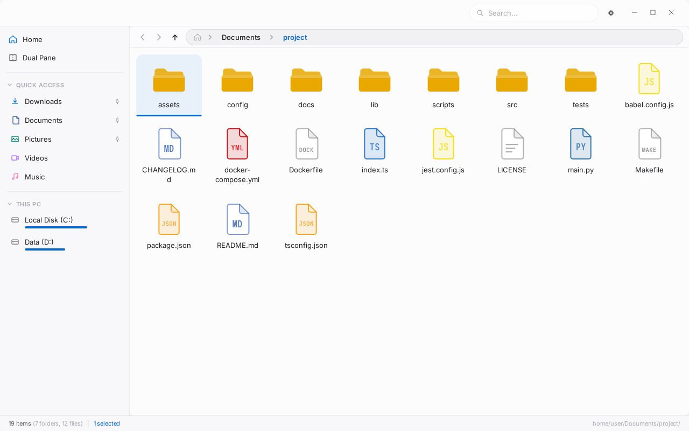
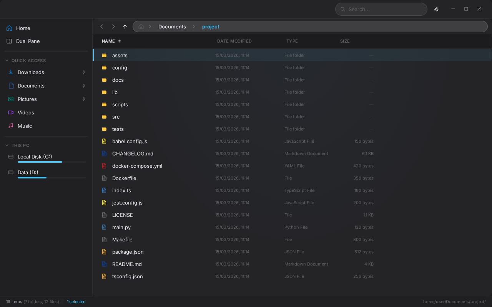

# Tauri Explorer

A minimal, keyboard-driven file manager for people who actually use their file manager.

Most file explorers fall into two camps: bloated and slow, or lightweight and missing half the features you need. Tauri Explorer is neither. It's a clean, fast, fully-featured file manager built for power users who want things to work the way they expect — and to customize the rest.

Built with Tauri v2 (Rust backend) and Svelte 5. Runs native on Linux, macOS, and Windows. The Rust backend handles directory listing, search, and thumbnails, so large directories don't choke the UI.



Everything else is toggleable. Turn on what you need.



## Features

**Keyboard-first.** Every operation has a shortcut. F2 to rename. Delete to trash. Ctrl+P for fuzzy search with frecency ranking. Ctrl+Shift+F for ripgrep-backed content search. Arrow keys, type-ahead, marquee selection. Every shortcut is rebindable, including chord sequences (e.g. `g then h` to go home).



**Tabs and dual pane.** Ctrl+T / Ctrl+W for tabs. Ctrl+\ for side-by-side dual pane with a draggable split. Restore closed tabs. New windows inherit context from the last focused one. Workspaces to save and restore layouts.



**Three view modes.** Details view with resizable, toggleable columns and virtual scrolling for directories with 10k+ files. List view with auto-column grid. Tiles view with progressive thumbnail loading. All three support the same selection, rename, and drag-drop operations.



**Full file operations.** Copy, move, rename, bulk rename, delete, compress/extract ZIP, create symlinks, undo/redo. Conflict resolution dialogs for overwrites. Progress tracking for large operations. Paste images directly from clipboard.

**Deeply customizable.** 8 built-in themes. Drop a `.css` file in `~/.config/tauri-explorer/themes/` to add your own. Adjustable background opacity and wallpaper. Zoom controls. Column visibility and sort preferences per-directory. Sidebar bookmarks with drag-to-add and reorder.



**Navigation that stays out of the way.** Editable breadcrumb bar with path autocomplete. Chevron pickers to browse subdirectories without navigating. Back/forward/up history. Type-ahead to jump to entries by name.

## Building

Requires [Rust](https://rustup.rs/), [Bun](https://bun.sh/), and [Tauri v2 prerequisites](https://v2.tauri.app/start/prerequisites/).

```bash
bun install
bun run start     # dev server
bun run build     # production build
```

## Testing

```bash
bun run test      # unit tests (vitest)
bun run test:e2e  # e2e tests (playwright)
```

## Status

Under active development. If you hit a bug, open an issue.

## License

See [LICENSE](LICENSE).
