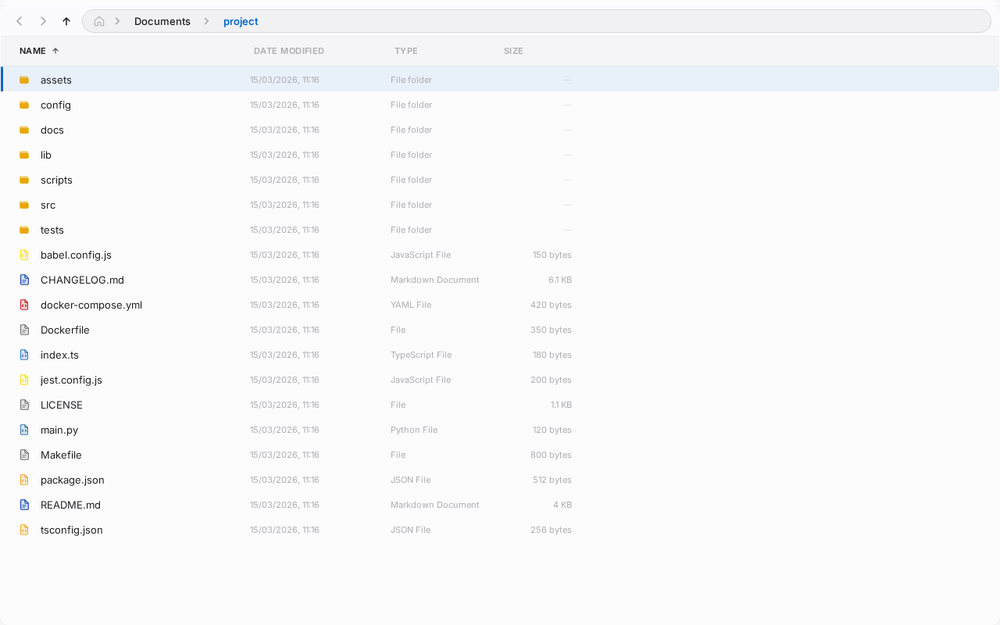
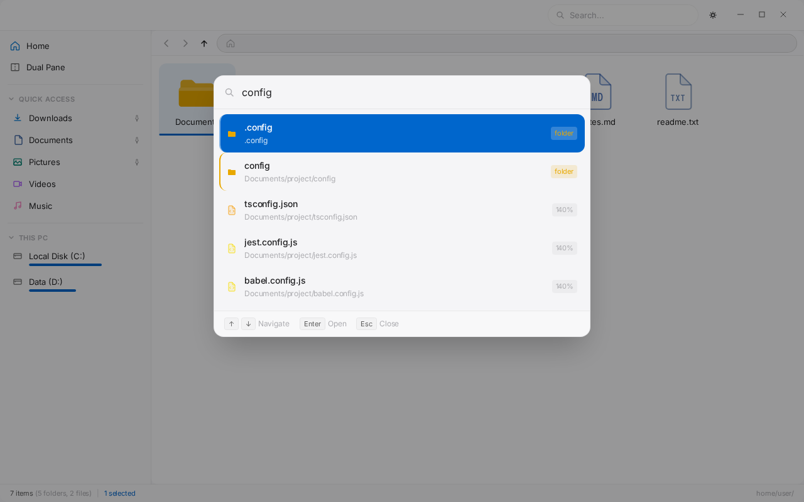
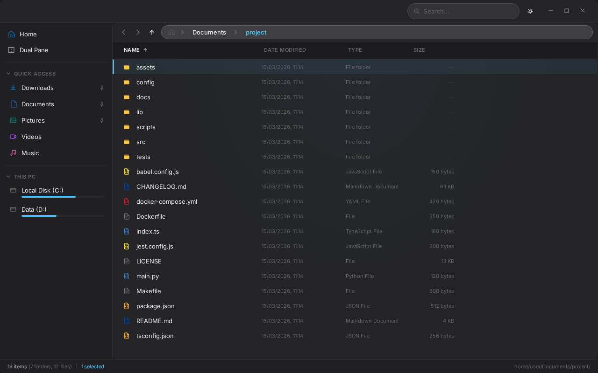
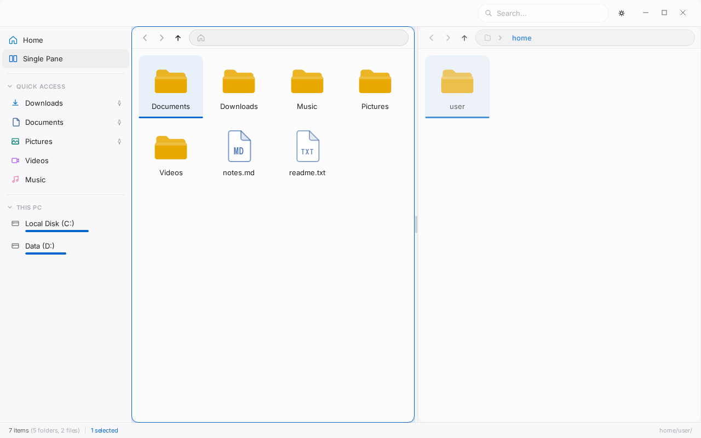
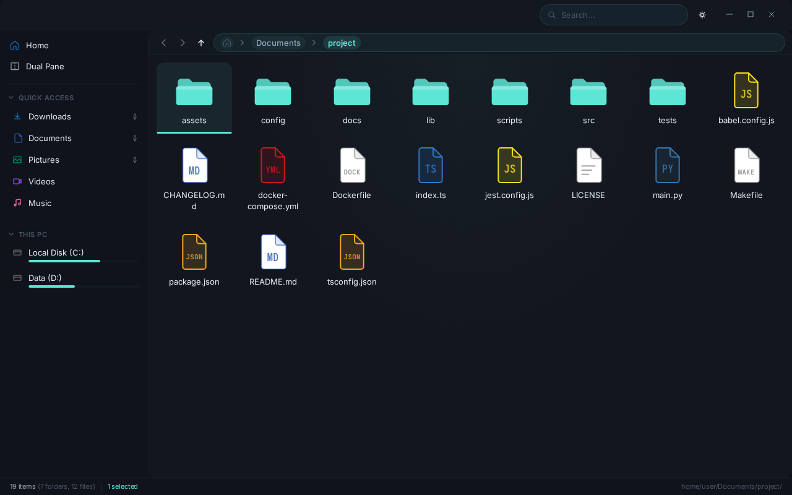

# Tauri Explorer

**A file manager with Ctrl+P, Ctrl+Shift+F, and a command palette.**

If you've ever opened VSCode just to navigate files faster than your file manager lets you, this is for you. Tauri Explorer brings the editor workflow to your filesystem: fuzzy file open with frecency ranking, ripgrep-backed content search, a command palette for every action, fully rebindable keybindings, and a UI you can strip down to nothing.



Built with Tauri v2 (Rust backend) and Svelte 5. Runs native on Linux, macOS, and Windows. The Rust backend handles directory listing, search, and thumbnails, so large directories don't choke the UI.

Every piece of chrome is toggleable. Turn on what you need.


## Features

**The shortcuts you already know.** `Ctrl+P` for fuzzy file open with frecency ranking — the same workflow as VSCode, but over your entire filesystem. `Ctrl+Shift+F` for ripgrep-backed content search across any directory. `Ctrl+Shift+P` for a command palette that surfaces every action in the app. Every shortcut is rebindable, including chord sequences (e.g. `g then h` to go home).



**Keyboard-first throughout.** `F2` to rename, `Delete` to trash, arrow keys and type-ahead to jump to entries, marquee selection with the mouse when you want it. Every operation has a shortcut, and you can rebind any of them.

**Minimal by default, customizable everywhere.** Hide the sidebar, toolbar, status bar, and breadcrumbs until you're looking at nothing but files. 8 built-in themes plus drop-in custom CSS (`~/.config/tauri-explorer/themes/`). Adjustable background opacity and wallpaper. Per-directory column visibility and sort preferences. Sidebar bookmarks with drag-to-add and reorder.



**Tabs and dual pane.** `Ctrl+T` / `Ctrl+W` for tabs. `Ctrl+\` for side-by-side dual pane with a draggable split. Restore closed tabs. New windows inherit context from the last focused one. Workspaces to save and restore layouts.



**Three view modes.** Details view with resizable, toggleable columns and virtual scrolling for directories with 10k+ files. List view with auto-column grid. Tiles view with progressive thumbnail loading. All three support the same selection, rename, and drag-drop operations.



**Full file operations.** Copy, move, rename, bulk rename, delete, compress/extract ZIP, create symlinks, undo/redo. Conflict resolution dialogs for overwrites. Progress tracking for large operations. Paste images directly from clipboard.

**Navigation that stays out of the way.** Editable breadcrumb bar with path autocomplete. Chevron pickers to browse subdirectories without navigating into them. Back/forward/up history.

## Building

Requires [Rust](https://rustup.rs/), [Bun](https://bun.sh/), and [Tauri v2 prerequisites](https://v2.tauri.app/start/prerequisites/).

```bash
bun install
bun run start     # dev server
bun run build     # production build
```

## Testing

```bash
bun run test      # unit tests (vitest)
bun run test:e2e  # e2e tests (playwright)
```

## Status

Under active development. If you hit a bug, open an issue.

## License

See [LICENSE](LICENSE).
