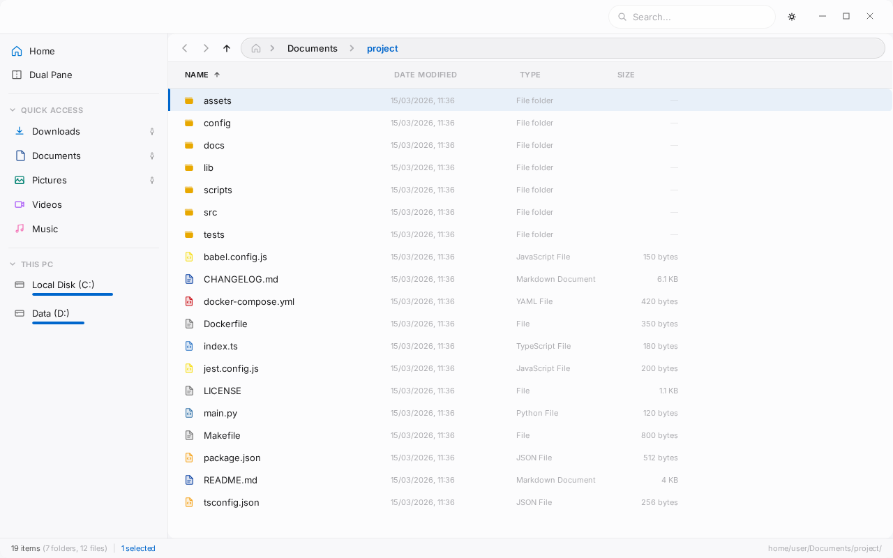

# Tauri Explorer

[](https://github.com/xnmp/tauri-explorer/actions/workflows/ci.yml)
[](https://github.com/xnmp/tauri-explorer/releases/latest)
[](LICENSE)

**A file manager with Ctrl+P, Ctrl+Shift+F, and a command palette.**

If you've ever opened your editor just to move files faster than your file manager lets you, this is for you. Fuzzy quick-open with frecency ranking, ripgrep content search, a palette for every action, rebindable keys, tabs and dual panes, a git commit graph, and a UI you can strip down to nothing. Tauri v2 (Rust) + Svelte 5, native on Linux, Windows, and macOS. No telemetry.

**→ [Try it in your browser](https://tauri-explorer.vercel.app)** — the showcase site is a working copy of the app. Press `Ctrl+P`.



## Install

Grab the [latest release](https://github.com/xnmp/tauri-explorer/releases/latest) — AppImage/deb/rpm, MSI, or dmg. On Linux it can even [replace your system file picker](https://tauri-explorer.vercel.app) (xdg-desktop-portal FileChooser backend).

```bash
# macOS (Apple Silicon or Intel) — one command; builds from source (checks
# for git/rustup/bun/Xcode CLT, clones, builds via the Tauri CLI), installs
# to /Applications, and clears the quarantine flag (sudo only if needed).
# Takes a few minutes since it compiles Rust — see #Building below for a
# manual walkthrough of the same steps.
curl -fsSL https://raw.githubusercontent.com/xnmp/tauri-explorer/main/mac_install.sh | bash

# macOS via Homebrew — second command needed until the app is notarized
brew install --cask xnmp/tap/tauri-explorer
xattr -r -d com.apple.quarantine /Applications/tauri-explorer.app

# Arch Linux (repacks the release .deb; source-build PKGBUILD at repo root)
git clone https://github.com/xnmp/tauri-explorer && cd tauri-explorer/packaging/aur && makepkg -si
```

Binaries aren't code-signed yet. Windows shows a SmartScreen warning on first launch. macOS reports un-notarized downloads as "damaged" and blocks them — the `xattr` command above clears the quarantine flag (Homebrew removed its `--no-quarantine` option, so this manual step is the only way until the app is notarized).

## Use as system file picker

On Linux, Tauri Explorer provides an `xdg-desktop-portal` FileChooser backend.
Portal backends are selected by your desktop portal configuration; installing the
package alone does not replace an existing GTK or desktop-specific file picker.

To select Tauri Explorer for file-picker requests, create
`~/.config/xdg-desktop-portal/portals.conf` with:

```ini
[preferred]
org.freedesktop.impl.portal.FileChooser=tauri-explorer
```

Restart `xdg-desktop-portal` or sign out and back in after changing the file.

### Windows: build and install from source

In PowerShell, one command downloads, builds, and installs the latest source:

```powershell
irm https://raw.githubusercontent.com/xnmp/tauri-explorer/main/windows_install.ps1 | Invoke-Expression
```

The script identifies any missing Git, Rust, Bun, or Visual Studio C++ Build Tools and prints the corresponding `winget` command. To build an existing checkout instead, run `./windows_install.ps1` from its root.

## Building

Requires [Rust](https://rustup.rs/), [Bun](https://bun.sh/), and [Tauri v2 prerequisites](https://v2.tauri.app/start/prerequisites/).

```bash
bun install
bun run start     # dev server
bun run build     # production build
bun run test      # unit tests
bun run test:e2e  # browser e2e
```

### Nix

On Linux with [Nix](https://nixos.org/download) (flakes enabled), no manual dependency install needed:

```bash
nix run github:xnmp/tauri-explorer          # build + launch, no install
nix profile install github:xnmp/tauri-explorer  # install to your profile
```

`nix build github:xnmp/tauri-explorer` produces the same release binary at `./result/bin/tauri-explorer`, built via nixpkgs' `cargo-tauri.hook` (same `--profile release` + `tauri/custom-protocol` path the Tauri CLI itself uses — not a bare `cargo build --release`, which yields a dev-mode binary).

For local development, `nix develop` (or `.envrc` + [direnv](https://direnv.net/)) drops you into a shell with the Rust toolchain, Bun, Node, and every WebKitGTK/GTK system dependency Tauri v2 needs already on `PKG_CONFIG_PATH` — no distro package install required:

```bash
nix develop
bun install
bun run start
```

## Status

Actively developed — see the [changelog](CHANGELOG.md) and [releases](https://github.com/xnmp/tauri-explorer/releases) for what's new. If you hit a bug: Command Palette → "Report Issue", or [open an issue](https://github.com/xnmp/tauri-explorer/issues/new/choose). Image attachments require authenticated [GitHub CLI](https://cli.github.com/) plus the optional [`gh-image`](https://github.com/drogers0/gh-image) extension (`gh extension install drogers0/gh-image`); background submission failures save the report draft for retry.
