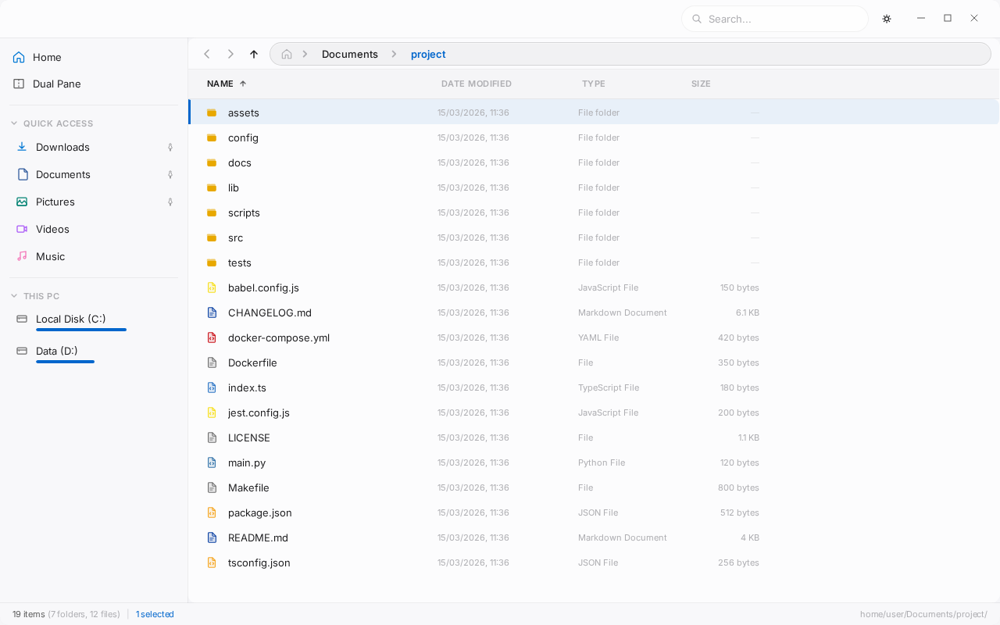

# Tauri Explorer

[](https://github.com/xnmp/tauri-explorer/actions/workflows/ci.yml)
[](https://github.com/xnmp/tauri-explorer/releases/latest)
[](LICENSE)

**A file manager with Ctrl+P, Ctrl+Shift+F, and a command palette.**

If you've ever opened your editor just to move files faster than your file manager lets you, this is for you. Fuzzy quick-open with frecency ranking, ripgrep content search, a palette for every action, rebindable keys, tabs and dual panes, a git commit graph, and a UI you can strip down to nothing. Tauri v2 (Rust) + Svelte 5, native on Linux, Windows, and macOS. No telemetry.

> **Status: early alpha.** The author uses it daily as their main file manager, but it hasn't had other users yet — expect rough edges, especially outside Linux. Bug reports are very welcome: Command Palette → "Report Issue" files one from inside the app.

**→ [Try it in your browser](https://tauri-explorer.vercel.app)** — the showcase site is a working copy of the app. Press `Ctrl+P`.



## Install

Grab the [latest release](https://github.com/xnmp/tauri-explorer/releases/latest) — AppImage/deb/rpm, MSI, or dmg. On Linux it can even [replace your system file picker](https://tauri-explorer.vercel.app) (xdg-desktop-portal FileChooser backend).

```bash
# macOS (Apple Silicon or Intel) — one command; builds from source (checks
# for git/rustup/bun/Xcode CLT, clones, builds via the Tauri CLI), installs
# to /Applications, and clears the quarantine flag (sudo only if needed).
# Takes a few minutes since it compiles Rust — see #Building below for a
# manual walkthrough of the same steps.
curl -fsSL https://raw.githubusercontent.com/xnmp/tauri-explorer/main/mac_install.sh | bash

```

Binaries aren't code-signed yet. Windows shows a SmartScreen warning on first launch. macOS reports un-notarized downloads as "damaged" and blocks them; after installing the downloaded Apple Silicon DMG, run `xattr -r -d com.apple.quarantine /Applications/tauri-explorer.app` to clear quarantine. The release page is the supported binary install route; the repository-root `PKGBUILD` provides an Arch source build. The older Homebrew cask and `packaging/aur` binary recipe are not current release channels.

On Arch, run `./arch_install.sh` from a checkout to build and install the current source. Repeated runs reuse frontend assets when their inputs and output contents are unchanged, avoiding an unnecessary Rust release relink. Dependencies are still prepared and Cargo checks native changes each time. Use `./arch_install.sh --rebuild` to force fresh frontend assets; source changes and missing or modified outputs rebuild automatically. Cold builds and builds after frontend or native changes still compile the optimized release. After generating new embedded assets, Cargo can require one additional native compile before its cache settles.

If a matching TraceExplorer `.teplugin` exists in `$HOME/Repos/TraceExplorer/package`, the Arch script queues the latest version for validated installation on the next app launch. Override its file or directory with `--plugin-path PATH` or `TRACE_EXPLORER_PLUGIN_PATH`. Missing packages are optional; plugin installation runs as the invoking user, after the host package succeeds. Startup uses the ordinary package validator and rollback flow. Failed requests move to `pending-plugins/failed` under the user config directory and surface as an error; rerun the script to retry a corrected package.

The default Arch package build timestamp follows the latest Git commit, or `package.json` modification time for source archives. Set `SOURCE_DATE_EPOCH` explicitly to override it.

File Cut verifies native clipboard ownership before moving the source, on X11, Wayland (with `wl-clipboard`), Windows, and macOS. If another program changes the clipboard between Cut and Paste, Paste copies instead of moving. Where ownership cannot be proven (for example, a remote-desktop session that re-renders every clipboard change), Cut reports it and Copy remains available.

## Use as system file picker

On Linux, Tauri Explorer provides an `xdg-desktop-portal` FileChooser backend.
Portal backends are selected by your desktop portal configuration; installing the
package alone does not replace an existing GTK or desktop-specific file picker.

To select Tauri Explorer for file-picker requests, create
`~/.config/xdg-desktop-portal/portals.conf` with:

```ini
[preferred]
org.freedesktop.impl.portal.FileChooser=tauri-explorer
```

Restart `xdg-desktop-portal` or sign out and back in after changing the file.

### Windows: build and install from source

In PowerShell, one command downloads, builds, and installs the latest source:

```powershell
irm https://raw.githubusercontent.com/xnmp/tauri-explorer/main/windows_install.ps1 | Invoke-Expression
```

The script identifies any missing Git, Rust, Bun, or Visual Studio C++ Build Tools and prints the corresponding `winget` command. To build an existing checkout instead, run `./windows_install.ps1` from its root.

## Building

Requires [Rust](https://rustup.rs/), [Bun](https://bun.sh/), and [Tauri v2 prerequisites](https://v2.tauri.app/start/prerequisites/).

```bash
bun install
bun run start     # dev server
bun run build     # production build
bun run test      # unit tests
bun run test:e2e  # browser e2e
```

### Nix

On Linux with [Nix](https://nixos.org/download) (flakes enabled), no manual dependency install needed:

```bash
nix run github:xnmp/tauri-explorer          # build + launch, no install
nix profile install github:xnmp/tauri-explorer  # install to your profile
```

`nix build github:xnmp/tauri-explorer` produces the same release binary at `./result/bin/tauri-explorer`, built via nixpkgs' `cargo-tauri.hook` (same `--profile release` + `tauri/custom-protocol` path the Tauri CLI itself uses — not a bare `cargo build --release`, which yields a dev-mode binary).

For local development, `nix develop` (or `.envrc` + [direnv](https://direnv.net/)) drops you into a shell with the Rust toolchain, Bun, Node, and every WebKitGTK/GTK system dependency Tauri v2 needs already on `PKG_CONFIG_PATH` — no distro package install required:

```bash
nix develop
bun install
bun run start
```

## Status

Actively developed — see the [changelog](CHANGELOG.md) and [releases](https://github.com/xnmp/tauri-explorer/releases) for what's new. If you hit a bug: Command Palette → "Report Issue", or [open an issue](https://github.com/xnmp/tauri-explorer/issues/new/choose). Submitted reports and selected images become public. If in-app submission fails, text is saved for retry and images remain available until the app window closes. The GitHub issue form opens when a new issue is safe to create; add images manually there.
