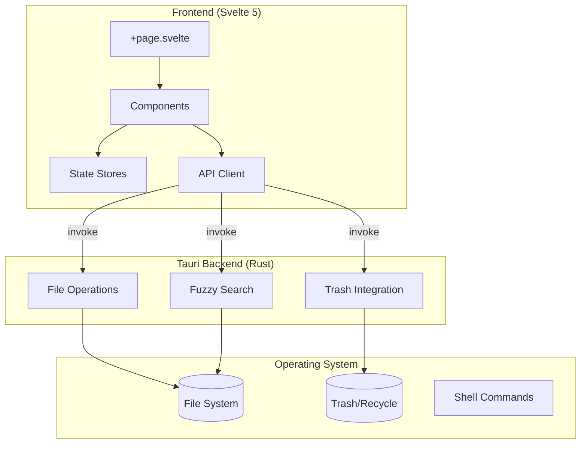
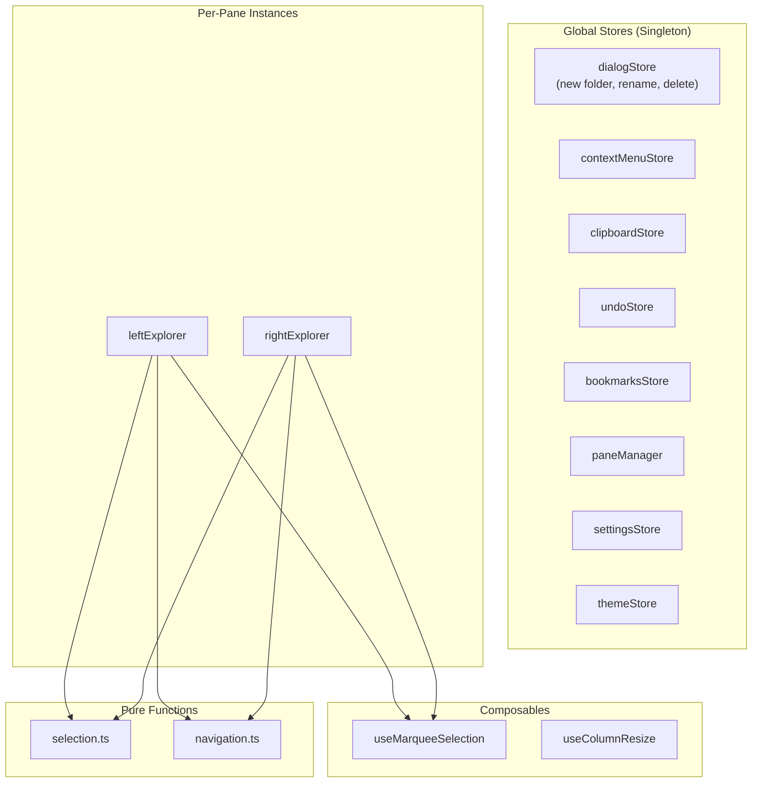
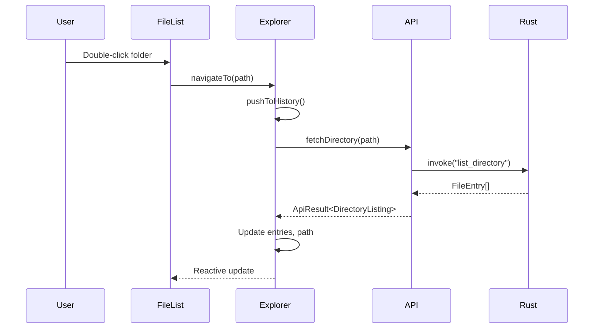
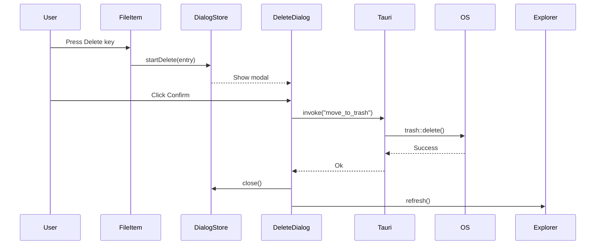
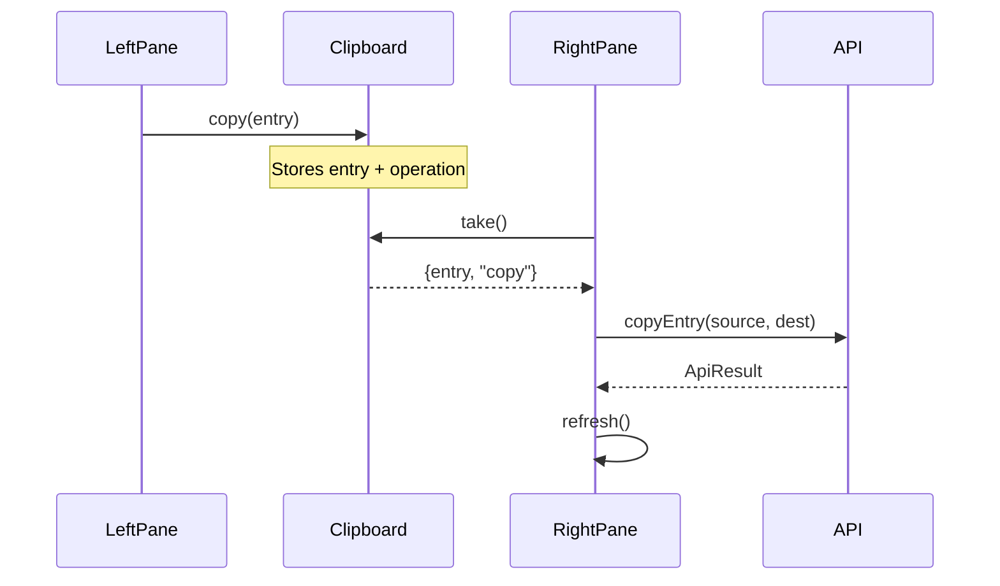

# Codebase Map

> Auto-generated by Cartographer. Last updated: 2026-01-16 (manual update for architecture refactoring)

## System Overview

A cross-platform file explorer built with **Svelte 5 + SvelteKit** (frontend) and **Tauri + Rust** (backend). Design follows **Windows 11 Fluent Design System** aesthetics.

> **Note**: Backend migrated from Python FastAPI to Rust Tauri commands (Issue: tauri-explorer-nv2y). All file operations now use direct IPC instead of HTTP.



### Architecture Decisions

| Layer | Technology | Purpose |
|-------|------------|---------|
| UI Framework | Svelte 5 (runes) | Reactive components with fine-grained reactivity |
| App Framework | SvelteKit (SPA) | Routing, build tooling, static adapter for Tauri |
| Desktop Runtime | Tauri 2 | Native window, IPC, system integration |
| File Operations | Rust (Tauri commands) | CRUD operations, fuzzy search (jwalk + nucleo) |
| Native Integration | Rust | Trash API, DPI awareness, window styling |

---

## Directory Structure

```
tauri-explorer/
├── src/                          # Svelte frontend source
│   ├── lib/
│   │   ├── api/                  # HTTP API client functions
│   │   │   └── files.ts          # File operations API (fetch, create, rename, etc.)
│   │   ├── components/           # Svelte UI components
│   │   │   ├── Breadcrumbs.svelte      # Path navigation trail
│   │   │   ├── ContextMenu.svelte      # Right-click menu
│   │   │   ├── DeleteDialog.svelte     # Delete confirmation modal
│   │   │   ├── ExplorerPane.svelte     # Self-contained file browser pane
│   │   │   ├── FileItem.svelte         # Single file/folder row
│   │   │   ├── FileList.svelte         # Main file grid with columns & sorting
│   │   │   ├── NavigationBar.svelte    # Editable path bar per pane
│   │   │   ├── NewFolderDialog.svelte  # Create folder modal
│   │   │   ├── PaneContainer.svelte    # Dual-pane layout with resizer
│   │   │   ├── QuickOpen.svelte        # Ctrl+P fuzzy file search
│   │   │   ├── RenameDialog.svelte     # Rename modal (unused, inline preferred)
│   │   │   ├── SettingsDialog.svelte   # Application settings
│   │   │   ├── SharedToolbar.svelte    # Global navigation buttons
│   │   │   ├── Sidebar.svelte          # Quick Access + bookmarks
│   │   │   ├── ThemeSwitcher.svelte    # Theme dropdown
│   │   │   ├── TitleBar.svelte         # Custom window title bar
│   │   │   ├── Toolbar.svelte          # (Legacy) command bar
│   │   │   └── VirtualList.svelte      # Windowed scrolling for performance
│   │   ├── domain/               # Pure domain logic (no side effects)
│   │   │   ├── file.ts           # FileEntry types, sorting, formatting
│   │   │   └── file-types.ts     # File extension detection, icons, colors
│   │   ├── composables/          # Reusable reactive logic (extracted from components)
│   │   │   ├── use-column-resize.svelte.ts   # Column resizing logic
│   │   │   └── use-marquee-selection.svelte.ts # Drag selection logic
│   │   ├── state/                # Reactive state management
│   │   │   ├── bookmarks.svelte.ts     # Sidebar pinned folders
│   │   │   ├── clipboard.svelte.ts     # Copy/cut/paste state
│   │   │   ├── context-menu.svelte.ts  # Menu position/visibility (extracted)
│   │   │   ├── dialogs.svelte.ts       # Modal dialog state (extracted)
│   │   │   ├── explorer.svelte.ts      # Core pane state (path, entries, selection)
│   │   │   ├── navigation.ts           # History/breadcrumb pure functions
│   │   │   ├── pane-context.ts         # Svelte context for pane communication
│   │   │   ├── panes.svelte.ts         # Dual-pane layout state
│   │   │   ├── selection.ts            # Selection calculation pure functions
│   │   │   ├── settings.svelte.ts      # UI preferences (toolbar, sidebar)
│   │   │   ├── theme.svelte.ts         # Theme management
│   │   │   ├── types.ts                # Shared TypeScript types
│   │   │   └── undo.svelte.ts          # Undo stack for file operations (extracted)
│   │   ├── themes/               # CSS theme files
│   │   │   ├── index.css         # Theme imports
│   │   │   ├── dark.css          # Dark theme variables
│   │   │   ├── light.css         # Light theme variables
│   │   │   ├── ocean-blue.css    # Ocean blue theme
│   │   │   └── solarized-light.css  # Solarized light theme
│   │   └── config.ts             # Application configuration
│   ├── routes/
│   │   ├── +layout.ts            # SvelteKit config (SSR disabled)
│   │   └── +page.svelte          # Main application shell
│   └── app.html                  # HTML template
│
├── src-tauri/                    # Tauri Rust backend (all file operations)
│   ├── src/
│   │   ├── lib.rs                # Tauri app setup, command registration
│   │   ├── files.rs              # File operations (list, create, rename, copy, move)
│   │   ├── search.rs             # Fuzzy search with nucleo + jwalk
│   │   └── main.rs               # Binary entry point
│   ├── capabilities/
│   │   └── default.json          # Security permissions
│   ├── build.rs                  # DPI awareness manifest
│   ├── Cargo.toml                # Rust dependencies
│   └── tauri.conf.json           # Tauri configuration
│
├── tests/                        # Frontend unit tests (Vitest)
│   ├── api/files.test.ts         # API client tests
│   └── domain/file.test.ts       # Domain function tests
│
├── e2e/                          # E2E tests (Playwright)
│   ├── file-operations.spec.ts   # Context menu, clipboard, rename, delete
│   ├── navigation.spec.ts        # Folder navigation, history
│   └── selection.spec.ts         # Single/multi/marquee selection
│
├── .beads/                       # Issue tracking (Beads)
├── .claude/                      # Claude Code configuration & agents
└── docs/                         # Documentation
```

---

## Module Guide

### Frontend Components

#### Core Navigation

| Component | Purpose | Key Props | Tokens |
|-----------|---------|-----------|--------|
| `ExplorerPane.svelte` | Self-contained file browser pane | `paneId`, `explorer?` | 1,076 |
| `FileList.svelte` | Main file grid with columns, sorting, marquee | `explorer` | 7,971 |
| `FileItem.svelte` | Single file row with inline rename, drag-drop | `entry`, `selected`, `explorer` | 5,283 |
| `VirtualList.svelte` | Windowed scrolling for performance | `items`, `itemHeight`, `children` | 542 |
| `Breadcrumbs.svelte` | Path navigation trail | (reads from explorer) | 959 |
| `NavigationBar.svelte` | Editable path bar per pane | `explorer` | 1,486 |

#### Layout

| Component | Purpose | Key Props | Tokens |
|-----------|---------|-----------|--------|
| `PaneContainer.svelte` | Dual-pane layout with resizable divider | `leftExplorer`, `rightExplorer` | 847 |
| `Sidebar.svelte` | Quick Access + bookmarks with drag-drop | (uses global stores) | 5,676 |
| `TitleBar.svelte` | Custom window controls (min/max/close) | - | 1,956 |
| `SharedToolbar.svelte` | Global back/forward/up/refresh buttons | - | 1,635 |

#### Dialogs & Menus

| Component | Purpose | Key Props | Tokens |
|-----------|---------|-----------|--------|
| `ContextMenu.svelte` | Right-click menu for file operations | (uses contextMenuStore) | 2,928 |
| `DeleteDialog.svelte` | Delete confirmation with warning | (uses dialogStore) | 2,110 |
| `NewFolderDialog.svelte` | Create folder form | (uses dialogStore) | 1,963 |
| `RenameDialog.svelte` | Rename form (unused, inline preferred) | (uses dialogStore) | 2,105 |
| `QuickOpen.svelte` | Ctrl+P fuzzy file search | `open`, `onClose` | 3,003 |
| `SettingsDialog.svelte` | Application settings | `open`, `onClose` | 2,745 |

#### Utilities

| Component | Purpose | Tokens |
|-----------|---------|--------|
| `ThemeSwitcher.svelte` | Theme selection dropdown | 1,494 |
| `Toolbar.svelte` | (Legacy) Windows 11 command bar | 2,455 |

---

### State Management

#### Architecture Pattern



#### Global Stores (Singletons)

| Store | File | Purpose | Persistence |
|-------|------|---------|-------------|
| `dialogStore` | `dialogs.svelte.ts` | New folder/rename/delete dialog state | No |
| `contextMenuStore` | `context-menu.svelte.ts` | Right-click menu position/visibility | No |
| `clipboardStore` | `clipboard.svelte.ts` | Copy/cut/paste state | No |
| `undoStore` | `undo.svelte.ts` | Undo stack for file operations | No |
| `bookmarksStore` | `bookmarks.svelte.ts` | Sidebar pinned folders | localStorage |
| `paneManager` | `panes.svelte.ts` | Dual-pane layout state | No |
| `settingsStore` | `settings.svelte.ts` | UI preferences | localStorage |
| `themeStore` | `theme.svelte.ts` | Theme selection | localStorage |

#### Composables (Reusable Logic)

| Composable | File | Purpose |
|------------|------|---------|
| `useColumnResize` | `use-column-resize.svelte.ts` | Draggable column width adjustment |
| `useMarqueeSelection` | `use-marquee-selection.svelte.ts` | Click-drag rectangle selection |

#### Per-Pane State (Factory)

| Export | File | Purpose |
|--------|------|---------|
| `createExplorerState()` | `explorer.svelte.ts` | Creates independent pane state |
| `ExplorerInstance` | `explorer.svelte.ts` | Type for explorer instance |

**Explorer State Structure:**
```typescript
{
  currentPath, history, historyIndex,      // Navigation
  entries, loading, error,                 // Data
  showHidden, sortBy, sortAscending, viewMode, // View options
  selectedPaths, selectionAnchorIndex      // Selection
}
```

#### Pure Utility Functions

| File | Exports |
|------|---------|
| `selection.ts` | `calculateSelection()`, `selectByIndices()`, `getSelectedEntries()` |
| `navigation.ts` | `pushToHistory()`, `canGoBack()`, `parseBreadcrumbs()`, `getParentPath()` |

---

### Domain Layer

| File | Purpose | Key Exports |
|------|---------|-------------|
| `file.ts` | Core file types and operations | `FileEntry`, `sortEntries()`, `filterHidden()`, `formatSize()` |
| `file-types.ts` | File extension detection | `getFileType()`, `getFileIconColor()`, `getFileIconCategory()` |

---

### API Layer

| File | Purpose | Key Functions |
|------|---------|---------------|
| `files.ts` | HTTP API client | `fetchDirectory()`, `createDirectory()`, `renameEntry()`, `deleteEntry()`, `copyEntry()`, `moveEntry()`, `fuzzySearch()` |
| `config.ts` | API base URL | `config.apiBaseUrl` (default: `http://localhost:8000`) |

**API Result Pattern:**
```typescript
type ApiResult<T> = {ok: true, data: T} | {ok: false, error: string}
```

---

### Tauri Rust Backend

#### Commands (callable from frontend via `invoke`)

| Command | Purpose | Module |
|---------|---------|--------|
| `list_directory(path)` | List directory contents | `files.rs` |
| `get_home_directory()` | Get user's home directory | `files.rs` |
| `create_directory(parent_path, name)` | Create new directory | `files.rs` |
| `rename_entry(path, new_name)` | Rename file/directory | `files.rs` |
| `copy_entry(source, dest_dir)` | Copy file/directory | `files.rs` |
| `move_entry(source, dest_dir)` | Move file/directory | `files.rs` |
| `open_file(path)` | Open file in default app | `files.rs` |
| `delete_entry_permanent(path)` | Permanent delete (not trash) | `files.rs` |
| `move_to_trash(path)` | Move single file to OS trash | `lib.rs` |
| `move_multiple_to_trash(paths)` | Batch trash operation | `lib.rs` |
| `fuzzy_search(query, root, limit)` | Fuzzy search files/folders | `search.rs` |

#### Key Rust Crates

| Crate | Purpose |
|-------|---------|
| `jwalk` | Parallel directory traversal |
| `nucleo-matcher` | Fast fuzzy matching |
| `chrono` | Date/time formatting |
| `fs_extra` | Advanced copy/move operations |
| `opener` | Open files with default app |
| `trash` | Cross-platform trash/recycle bin |

#### Platform-Specific Features

- **Windows**: Rounded window corners (DWM API), PerMonitorV2 DPI awareness
- **All platforms**: Cross-platform trash via `trash` crate

---

## Data Flow

### Navigation Flow



### File Operation Flow (Delete)



### Cross-Pane Copy/Paste



---

## Conventions

### Svelte 5 Runes

- `$state`: Mutable reactive state
- `$derived`: Computed values that auto-update
- `$effect`: Side effects (localStorage sync, focus management)
- `$bindable`: Two-way binding for props

### State Management Patterns

1. **Singleton stores**: For truly global state (clipboard, theme, settings)
2. **Factory functions**: For multi-instance state (`createExplorerState()`)
3. **Pure utilities**: For calculation logic (selection, navigation)
4. **Svelte context**: For passing state down component tree without prop drilling

### Error Handling

- **Frontend**: Result type (`{ok, data} | {ok, error}`)
- **Rust Backend**: `Result<T, FileError>` with thiserror for typed errors
- **Tauri IPC**: Errors serialized as strings for frontend consumption

### File Naming

- Components: `PascalCase.svelte`
- Stores: `kebab-case.svelte.ts`
- Pure functions: `kebab-case.ts`
- Types: `kebab-case.ts`

---

## Gotchas

### State & Reactivity

1. **Explorer state is a derived getter** - combines core state + global stores for backward compatibility
2. **Cut operations clear clipboard after paste** - copy operations don't
3. **Dialogs use global store** - only one dialog type can be open across all panes
4. **Theme uses `data-theme` attribute** on `<html>`, not CSS-in-JS

### Component Behavior

5. **Right-clicking unselected item** auto-selects only that item
6. **Breadcrumbs don't include root** - starts from first path segment
7. **Virtual list requires fixed height** - won't work with variable-height items
8. **Marquee selection only in details view** - list/tiles use normal click
9. **Drag-end click prevented** to avoid clearing marquee selection

### File Operations

10. **Delete uses OS trash** - not permanent deletion (via Tauri trash crate)
11. **Copy auto-generates names** - `file.txt` becomes `file - Copy.txt` on conflict
12. **Move raises error on conflict** - unlike copy, doesn't auto-rename
13. **Search is relative to current directory** - not global filesystem

### Navigation & Layout

14. **Dual pane toggle resets to left pane** when disabled
15. **History truncates forward entries** when navigating after going back
16. **Sidebar width persisted separately** from main settings store

### Backend

17. **Rust search limited to 10k files** - prevents memory exhaustion (configurable in search.rs)
18. **Tauri `move_multiple_to_trash` validates ALL paths before deleting ANY** (fail-fast)
19. **Direct IPC** - no HTTP server, no CORS concerns

---

## Navigation Guide

### To Add a New File Operation

1. **Rust**: Add command in `src-tauri/src/files.rs` with `#[tauri::command]`
2. **Rust**: Register command in `src-tauri/src/lib.rs` invoke_handler
3. **Frontend**: Add API function in `src/lib/api/files.ts` using `invoke()`
4. **Frontend**: Add state method in `src/lib/state/explorer.svelte.ts`
5. **Frontend**: Add UI trigger in `ContextMenu.svelte` or `FileItem.svelte`
6. **Tests**: Add tests in `src-tauri/` (Rust) and `tests/api/` (TS)

### To Add a New Component

1. Create `src/lib/components/NewComponent.svelte`
2. Import in parent component (likely `+page.svelte` or `ExplorerPane.svelte`)
3. If needs pane state: use `getContext("pane-explorer")`
4. If needs global state: import from `src/lib/state/`

### To Add a New Global Store

1. Create `src/lib/state/new-store.svelte.ts`
2. Export singleton: `export const newStore = createNewStore()`
3. If needs persistence: add localStorage sync in `$effect`
4. Import where needed (components, other stores)

### To Add a New Theme

1. Create `src/lib/themes/new-theme.css` with CSS custom properties
2. Import in `src/lib/themes/index.css`
3. Add theme ID to `ThemeId` type in `theme.svelte.ts`
4. Add option in `ThemeSwitcher.svelte`

### To Add a Tauri Command

1. Add function in `src-tauri/src/lib.rs` with `#[tauri::command]`
2. Register in `.invoke_handler()` builder
3. Add permission in `src-tauri/capabilities/default.json` if needed
4. Call from frontend: `await invoke("command_name", {args})`

### To Run Tests

```bash
# Frontend unit tests (Vitest)
bun test              # Watch mode
bun test:run          # Single run

# Rust backend tests
cd src-tauri && cargo test

# E2E tests (Playwright)
bun test:e2e          # Headless
bun test:e2e:ui       # Interactive UI

# Type checking
bun check
```

### To Start Development

```bash
# Single terminal - Tauri handles everything
bun tauri dev
```

---

## Test Coverage

### Automated Tests

| Category | Files | Test Count |
|----------|-------|------------|
| E2E (Playwright) | 3 | 31 |
| Unit - API | 1 | 17 |
| Unit - Domain | 1 | 11 |
| Rust - Files | 1 | 4 |
| Rust - Search | 1 | 3 |

### Coverage Gaps

- Multi-pane operations (drag between panes)
- View mode switching (details/list/tiles)
- Hidden files toggle
- Path bar editing
- Preview pane (not implemented)
- Performance benchmarks

---

## Technical Debt

### Completed Refactoring

The `explorer.svelte.ts` God-object has been split into focused stores:
- `dialogs.svelte.ts` - Modal dialog state (new folder, rename, delete)
- `context-menu.svelte.ts` - Right-click menu position/visibility
- `undo.svelte.ts` - Undo stack for file operations

Explorer now focuses on: navigation, directory loading, and selection (~250 lines).

### Remaining Items

| Issue | Current | Target |
|-------|---------|--------|
| `FileList.svelte` | ~750 lines | ~500 lines |
| Svelte warnings | 9 (a11y) | 0 |

### Planned Extractions

- `ColumnHeaders.svelte` from FileList
- `MarqueeSelection.svelte` from FileList (logic extracted to `use-marquee-selection.svelte.ts`)

---

## Dependencies

### Frontend

| Package | Version | Purpose |
|---------|---------|---------|
| `svelte` | ^5.0.0 | UI framework (runes API) |
| `@sveltejs/kit` | ^2.9.0 | App framework |
| `@tauri-apps/api` | ^2 | Tauri IPC |
| `@playwright/test` | ^1.57.0 | E2E testing |
| `vitest` | ^2.0.0 | Unit testing |

### Rust

| Crate | Version | Purpose |
|-------|---------|---------|
| `tauri` | 2 | Desktop runtime |
| `trash` | 5 | Cross-platform trash |
| `chrono` | 0.4 | Date/time handling |
| `dirs` | 5 | System directories |
| `fs_extra` | 1.3 | Advanced file operations |
| `opener` | 0.7 | Open files with default app |
| `nucleo-matcher` | 0.3 | Fuzzy matching |
| `jwalk` | 0.8 | Parallel directory traversal |
| `thiserror` | 2 | Error handling |
| `windows` | 0.58 | Win32 APIs (Windows only) |

---

*Map generated by [Cartographer](https://github.com/kingbootoshi/cartographer)*
