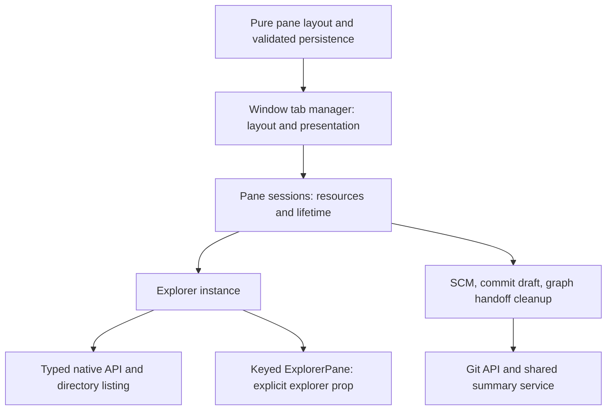

# Repository health and startup review — #680

Reviewed against `ea256aaf` (dev), September 2026. This document records the
implemented cleanup and the next highest-value work. It is a source review
with targeted runtime verification, not a claim that every path in the roughly
90,000-line application has been exhaustively audited.

The full review is **not complete**. The initial foundation report has been
published on [issue #680](https://github.com/xnmp/tauri-explorer/issues/680),
and the implementation foundation is published in
[draft PR #684](https://github.com/xnmp/tauri-explorer/pull/684) against `dev`. [review-completion.md](review-completion.md)
is the current requirement-by-requirement ledger; the earlier verification and
handover below describe the initial foundation checkpoint, not final acceptance
of the ongoing pass. macOS half-bounce measurements remain outstanding.

The latest cache pass corrected a misleading native acceptance precondition:
the hidden-graph test had reopened without ever retaining its target snapshot.
Snapshot-first verification exposed read-triggered invalidation on Linux and
missing observation while graphs were hidden. Pending reads and retained
snapshots now own shared acknowledged repository watches; native registration
requires complete worktree/shared-ref coverage and release uses the acquired
identity. UNC graphs read fresh without adding hidden recursive polls. The
following native service pass adds unique, idempotent leases, owned recovery and
debounce deadlines, failed-emission retries and parent coverage for root replacement.
SCM now shares the ordered watch owner. A local 12-repository measurement confirms
observer sharing and final cleanup; see the ledger for its scope and remaining
resource/platform work. These changes do not establish the macOS startup target.

The ongoing pass has implemented feature-owned API wrappers, bounded inactive
refresh metadata, config-watch retarget cleanup, draining native plugin workers,
validated native window inputs, acknowledged tab handoffs, inactive-tab lazy
restoration, window startup ownership, interaction consistency, and graph query/PR/branch
and commit-detail state ownership with immutable shared snapshots. Numeric
settings now share consumer constraints across validation and setters. Window
keyboard dispatch now composes pure routing with an owned listener lifetime,
terminal exceptions preserve command identity, and terminal opening owns a
cancellable focus request across lazy loading. Graph mutation refresh invalidates
old cache entries before publishing fresh history. The current local checkpoint
also gives graph headers and rows shared full-table geometry, preserves complete
reference access through the existing menu owner, and restores native/custom
button activation ownership. Native launch rollback now also separates a JavaScript
label proxy from proven native creation ownership: duplicate-label errors preserve
the existing window, while cancelled late creations are destroyed only after
successful creation. Each remains
subject to the integration and platform evidence recorded in that ledger.

## Product and architectural direction

The core product is a fast, keyboard-friendly file explorer with optional Git,
preview, terminal, plugin, and appearance capabilities. Customization should
change presentation and available tools without making every launch initialize
every feature. The default experience should remain visually quiet, predictable,
and immediately usable.

The Ghostty comparison sets a useful quality bar. Ghostty uses native platform
interfaces; this application pays for a webview, JavaScript, CSS and Svelte as
well as native setup. That difference requires measurement, not a presumption
that a webview is either adequate or disqualifying. Preserve the portable domain
and Rust services while measuring whether the presentation stack can meet the
target. [Ghostty architecture](https://ghostty.org/docs/about).

| Area | Existing design | Assessment |
| --- | --- | --- |
| Domain | Pure path, selection, graph, search and layout helpers | Strong foundation; keep policy importable and dependency-free. |
| State | Per-pane explorer factories, window/tab ownership, shared caches | Useful ownership model; lifecycle and invalidation gaps deserve more attention than file length. |
| API | Typed IPC wrappers and structured errors; browser fixture backend | Keep native dispatch independent of fixtures; progressively reduce the `files.ts` aggregator's role. |
| Rendering | Svelte components, shared FileIcon, three virtualized file views | Preserve shared seams and virtualized rendering. Feature code should enter on demand. |
| Native work | Async Tauri commands, blocking-work offload, native watchers and git | Existing cancellation, generation and filesystem safety contracts are valuable; broad replacement is high risk. |
| Customization | CSS theme tokens, settings, commands, plugin context | Preserve the token system. Consolidate inconsistent controls and native conventions incrementally. |
| Verification | Domain tests, mock browser E2E, native tests, performance suites | Good breadth, but copied implementations and unexecuted guardrails weaken confidence. |

## Implemented

1. Browser fixtures load only on browser IPC. Native startup no longer evaluates
   the mock filesystem and fake Git history. Detection retains its existing
   late-injection and positive-latching behavior.
2. GitGraphView loads on first opening. Its resolved constructor is retained in
   state for synchronous subsequent mounts; pending imports are shared. Failed
   loading reports an error and provides a route back to working file browsing.
   Snapshot warming remains independent of component loading.
3. Commit-file caching moved from a component module to a state factory. Tests
   now exercise the real cache, including full-OID and repository isolation,
   eviction, empty results and failed requests.
4. Replacement-session teardown failures now propagate when they overlap manager
   disposal, after the other pending cleanup has settled.
5. Recycle Bin orchestration moved from domain to state. The stale linter
   exception permitting state to import GitGraphView was removed. Architecture
   lint and startup bundle budgets now run in frontend CI.
6. Back/up/refresh controls, breadcrumbs and caret buttons paint hover feedback
   immediately. Existing theme geometry, colors and structural motion remain.
7. Startup records listing, commands and settings separately, then core Explorer
   readiness after a frame opportunity. Empty directories now report. The native
   setup timer includes window construction; main-window readiness also records
   elapsed time from `run()` on the Rust clock. macOS smoke waits for that signal.
8. Pane lifetime now has one owner (`state/pane-sessions.ts`), keyed directly by
   the layout pane ID. Close, collapse, tab removal, workspace replacement and
   disposal share detachment and a pending-work ledger. Presentation stays in
   the tab manager; components receive their owned explorer explicitly.
9. SCM distinguishes temporary panel release from permanent store destruction.
   Destruction removes its Git subscriber, drains prior panel unwatch work and
   pending activations, and compensates stale watcher registration. Store-local
   consumer identities prevent an old pane from cancelling its replacement's
   summary scan. Restore also clears old commit drafts and graph handoffs.
10. Saved layouts are validated before allocation: duplicate IDs, cyclic or
    excessively deep trees, and non-finite geometry are rejected. A corrupt
    later tab sharing identities is dropped; missing active-pane IDs select a
    valid leaf. Dictionary construction retains unusual string IDs as own data
    properties, then produces plain objects compatible with Svelte reactivity.

## Ownership after the overhaul

New pane resources attach to the session cleanup boundary once, rather than
adding cleanup to every close/restore branch. Layout operations remain
synchronous so creating a pane does not await old filesystem work. Detachment
happens before replacement; shutdown waits for all already-started work.

The UI captures the explorer for the keyed mount lifetime. Reading a reactive
registry lookup during teardown is unsafe: the parent has already removed that
entry. Browser tests exposed this during the refactor and now assert both
successful close/restore/navigation and absence of uncaught errors.

## Measured startup payload

Production build, same dependency lockfile, unique JavaScript statically
reachable from all Vite entry records. Dynamic features, CSS, fonts and images
are excluded. Small byte differences between builds are expected from generated
chunk identifiers.

| Build | Static JS raw | Static JS gzip | Largest JS raw / gzip |
| --- | ---: | ---: | ---: |
| Baseline `ea256aaf` | 866,617 B | 277,378 B | 365,537 / 107,296 B |
| Lazy browser backend | ~807,987 B | 257,351 B | 365,720 / 107,355 B |
| Lazy backend + Git graph, resolved constructor retained | 604,631 B | 192,298 B | 287,746 / 84,185 B |
| Including pane/SCM ownership overhaul | 605,872 B | 192,956 B | 287,887 / 84,268 B |
| Including deeper release-foundation changes | 612,853 B | 195,688 B | 288,726 / 84,554 B |
| Including graph owners, lazy restored panes and numeric contracts | 621,678 B | 199,820 B | 290,770 / 85,389 B |

The current change removes approximately 28% of static startup JS. This is **not**
a measured 30% launch-time improvement. The budget retains the pre-cleanup raw
and gzip totals as hard caps; raising them requires an audited baseline and a
reason. Chunk splitting alone cannot evade the total. Dynamic import is the
bundler's standard feature-loading boundary. [Vite production builds](https://vite.dev/guide/build).

## Half-bounce acceptance

The end target is usable pixels and input by halfway through the first macOS
Dock bounce. Do not convert that animation into an assumed universal number of
milliseconds. Establish the actual threshold on the supported Mac hardware and
OS, then retain both the visual criterion and measured latency percentiles.

The current readiness signal covers the **core file explorer**: settings loaded,
commands registered, directory listing complete (including empty), and a DOM
paint opportunity. It does not certify a restored Git history, terminal process,
all plugins, watcher readiness, or compositor presentation. The browser tests
exercise navigation and selection after the signal. They do not measure native
filesystem latency or WKWebView startup.

Use this release acceptance procedure:

1. Build a release app with embedded assets (`bun run tauri build`). Use a clean
   test profile; disable the warm-window pool for cold-launch measurements.
2. Record launch-to-first-presented-frame and launch-to-successful interaction
   externally on macOS. Profile the launch using Instruments' App Launch
   template; inspect loading, window creation, main-thread work, and filesystem
   waits separately. [Apple launch profiling](https://developer.apple.com/documentation/xcode/reducing-your-app-s-launch-time).
3. Test empty/small directories, a large directory, a Git worktree, restored
   multi-pane sessions and restored optional surfaces. Separate cold process
   launch, filesystem-cache-warm process launch and warm-window activation.
4. Retain at least 30 samples per scenario, hardware/OS/build/profile metadata,
   p50/p95 and the slowest trace. Record the Dock animation and an interaction
   outcome together; a loading shell is insufficient.
5. Correlate external traces with `Startup:` (native setup through window build),
   `Startup(webview):` (`bundle-exec`, `mount`, `commands-ready`, `settings-ready`,
   `list-ready`, `ui-ready`), and `Startup(native-ready): app-run-to-ready`.
   The last includes IPC receipt delay and excludes process loading before
   `run()`. Never add unrelated Rust and JavaScript clock totals.

The macOS CI job is a debug-build smoke test on a shared runner. Its 30-second
timeout detects broken startup; it is not the product's performance budget.
The half-bounce criterion remains unverified until the release procedure runs
on a Mac. If native window/webview creation dominates after feature deferral,
use that trace to decide whether a native shell/list renderer is warranted.

## Deeper release-foundation pass

This pass follows feature boundaries through their asynchronous and native
lifetimes. It strengthens shared services that the next features will use:

- Directory watches now have serialized acquire/release owners, shared by pane,
  thumbnail, Miller-column and drive lifetimes. Closing while registration is
  pending drains the late acquisition. Drive discovery/listeners also retain
  a session owner and coalesce overlapping polling requests.
- Graph warming and visible page-zero loads capture a writer before reading.
  Local and external changes revoke both snapshots and pending writers. Keys
  are structured tuples, so valid filesystem characters cannot break eviction.
  Paging owns the visible tail; it does not republish the retained first page
  or supersede a still-pending working-tree summary. Queued reloads revoke the
  active generation immediately and are awaited through one serialized drain;
  unmount revokes publication. Graph watches use ordered native ownership.
- The shared working-tree summary cache now invalidates both settled and
  joinable scans on Git changes, uses a 64-entry LRU and retries failures. A
  cancelled/failed summary cannot be cached as a zero-change graph snapshot.
- Repository decoration and speculative Git warming share bounded root probes,
  pending-request deduplication, separate positive/negative reuse horizons and
  invalidation through existing file/Git buses. Per-path warm resolutions are
  retained only while an owner needs them. Latest-probe identity prevents an
  older same-path lookup from replacing a newer one. Pending nested repositories
  are not assigned to an ancestor’s cache owner by path inference.
- Preview reads share full revision ownership (path, modification time and
  size), including failures. Blob URLs and drag listeners have explicit
  lifetimes. Browser outcomes were also run against the pre-fix PreviewPane:
  all three reproduced stale text/image publication or post-unmount resizing.
- Terminal frontend reservation, listeners, process creation and teardown have
  one owner. Native reservations belong to a window, are atomically claimed
  once and cannot be controlled by another window's ID. Native PTY locking and
  termination passed independent adversarial verification and real PTY tests.
  Blocking input does not hold the global registry lock. The owned shell is
  reaped independently of reader EOF; detached or separate job-control process
  groups are explicitly outside this resource-cleanup guarantee.
- Native cancellation registration rejects duplicate active client IDs before
  filesystem side effects. Generated IDs cannot collide with active client
  reservations or pre-cancelled requests.
- Config saves follow final symlinks, preserve the link itself and create a
  unique exclusive temporary file alongside the resolved target. Tests cover
  chains, loops, dangling final targets and planted temporary-file symlinks.
  The resolved destination is captured once per save; concurrent retargeting
  does not redirect that in-progress write to another file.
- Settings and workspaces validate untrusted persisted data before application
  allocation/use. Layouts retain the existing bounded normalizer; future-version
  settings retain unknown preferences in a separate round-trip envelope. Numeric
  values use consumer ranges; stored settings and aggregate workspace allocation
  have explicit safety budgets.
- Command, menu, dialog and filesystem contributions share invocation identity.
  Old disposers cannot remove replacements. Plugin collisions cannot silently
  replace core commands, and late contributions are immediately disposed after
  their context closes. Built-in and contributed modal surfaces share the
  application input gate, including the shortcut help overlay.

[ADR 0008](adr/0008-resource-and-contribution-ownership.md) records the extension
contract. These are resource-specific state owners, not a new application
framework. They preserve existing feature APIs and refresh policy where those
contracts are sound.

## Review depth and remaining release work

| Boundary | Evidence gathered | Remaining acceptance |
| --- | --- | --- |
| Startup and optional feature loading | Static dependency closure, bundle budgets, native timing probes, browser ready-to-interact outcomes | Release macOS launch traces and half-bounce recording; restored optional surfaces are outside core readiness. |
| Pane/session and SCM lifetime | Production interleaving tests; native close/restore with real filesystem and Git changes | Longer churn/heap profiling across repeated workspace replacements. |
| Directory watches and caches | Reproduced delayed-acquisition and invalidation races; production cache factories; native watcher tests | Native hidden-graph remount passed; cross-platform watcher soak remains. |
| Preview and modal interaction | Production ownership tests, real browser feature outcomes and pre-fix failures | Full custom-theme, assistive-technology and narrow-layout acceptance. |
| Terminal processes | Real PTY tests plus independent attempts to wedge locks and ignore termination | Native integrated terminal regressions passed; Windows ConPTY/macOS confirmation remains. |
| Persistence and file safety | Malformed-data tests, symlink/temp-file fixtures, native cancellation tests | Native Windows/macOS atomic replacement and config autoreload coverage. |
| Extension contributions | Collision, same-value replacement, late registration and modal ownership regressions | More plugin combinations and failed activation/teardown outcomes. |
| Git operations/search/refresh | Existing ADRs, code maps and cancellation/cache seams inspected; relevant suites retained | No claim to re-audit every Git mutation, search-cache backend interleaving or network failure in this pass. |
| Appearance and rendering | Shared visual seams preserved; immediate hover fixed; virtualization tests retained | No wholesale redesign or certification of every theme, preview format or DPI/zoom combination. |

Prioritize remaining work by observed failure or a measured budget:

1. **Release performance gate:** run the macOS procedure above before calling
   startup optimized. Record interaction latency and long-session memory too;
   a smaller bundle alone does not establish either.
2. **External job cancellation:** audit `plugin_job.rs` blocking upscale work.
   Timing out a future does not necessarily stop its blocking upload/poll/write
   operation. Prove that cancellation cannot report completion and then write
   output later before expanding long-running AI features.
3. **Long-session retention:** measure refresh-manager timing/baseline maps and
   config watcher registrations. Config retains prior roots deliberately under
   ADR 0004; removing them blindly would break symlink handover observation.
4. **Orchestration decomposition:** root startup and GitGraphView still combine
   several concerns. Extract the next feature's policy/state boundary with its
   behavior tests. File splitting without a clear owner or dependency reduction
   is not itself an architectural or performance improvement.
5. **API dependency cleanup:** gradually move feature consumers off the large
   `api/files.ts` aggregator and remove dispatcher import cycles using
   `api/common.ts`. Avoid a wholesale naming-only rewrite.
6. **Remaining trust boundaries:** normalize external window seed payloads and
   audit numeric setting ranges against each consumer's actual constraints.
   Current validation rejects wrong types/non-finite and out-of-range known
   numeric settings; new settings must declare their own bounds.
7. **Native path identity:** verify equivalent case/separator/trailing-slash
   watch paths on Windows against notify. Rust currently refcounts raw strings;
   the frontend owner alone cannot prove alias registration is safe. WSL Linux
   suffixes now preserve case in comparison keys, and normalized cache keys are
   never substituted for native IPC paths. [Microsoft’s filesystem guidance](https://learn.microsoft.com/en-us/windows/wsl/filesystems).
8. **Interaction consistency:** inspect remaining `transition: all`, semantic
   colors, standard address-bar focus commands and custom theme controls against
   concrete browser/native outcomes. Preserve immediate pointer response.

The review is comprehensive at the cross-cutting boundary level and deeper than
a style or file-size sweep. It is not exhaustive line-by-line proof of the whole
application. The remaining table is part of release planning, not a claim that
unexercised platforms or feature combinations passed.

## Visual and implementation review

The incumbent visual direction is already coherent: compact navigation, shared
file icons, configurable themes, and restrained default chrome. A redesign would
add risk without addressing the principal launch costs. This pass fixes measured
hover settling and retains the existing visual system.

The design detector reported four candidates. The blockquote's accent border is
content styling, not a card decoration; the reported broken `` is text in a
comment; compact preview typography and Inter are intentional desktop-tool
choices. None justified a cosmetic rewrite. Contrast across every custom theme,
assistive-technology interaction, native font rendering and narrow split-pane
layouts remain separate acceptance work; this review makes no WCAG certification.

## Verification and boundaries

Baseline: 182 unit-test files passed (1,690 tests, 3 skipped), 30 performance
tests passed; architecture lint failed on the Recycle Bin dependency. The first
type-check failure was a missing installed `yaml` dependency, resolved by
`bun install --frozen-lockfile` without changing the lockfile.

Regression evidence includes pre-fix failures for empty-directory readiness,
navigation hover settling, ignored teardown failures, and the first lazy-graph
implementation's transient remount placeholder. Independent review confirmed
the payload accounting, dispatch behavior, teardown fix and lazy-load lifecycle,
and identified the remount issue before completion.

Earlier verification after the pane ownership overhaul: 189 unit files passed
(1,719 tests, 3 skipped), plus 30 performance tests. The architecture pass ran
33 targeted Chromium tests (including close/restore/navigation in all three
view modes) and 24 WebKit tests. Type checking, architecture lint, full static
startup budgets and code-map coverage (322/322 files) passed. Earlier Rust
compilation/formatting and eight system tests also passed; the final native
binary rebuilt successfully with embedded assets and E2E hooks.

Seven native Tauri outcomes passed using isolated XDG config/data/cache roots:
three streaming cases, two external-filesystem watcher cases, and two new pane
lifecycle cases. Those verify that restored and surviving panes both receive
external directory changes, and that a restored SCM store receives real Git
watcher updates after its predecessor is destroyed. Deferred-promise tests
cover the exact late-subscription, late-watch, reverse-completion and
panel-release-versus-destroy interleavings. Independent review verified the
final lifetime ledger and same-ID replacement boundaries.

The standalone native-suite TypeScript check still has pre-existing errors in
its commonjs configuration, config-autoreload test, terminal-key-ownership test,
and WDIO options; the new native spec reports no type error with TypeScript 6's
deprecation warning suppressed. Native tests execute through WDIO successfully.

Final deeper-pass verification:

- 199 unit files passed: **1,796 tests**, three skipped; all 30 performance
  tests passed. Type checking reports zero errors and warnings.
- Browser coverage passed the graph/cache/preview/pane outcomes (46 cases after
  isolated reruns), plus startup/hover/modal/pane coverage across view modes.
  The final graph/lazy-load/modal Chromium run passed 44/44, with a further
  4/4 WebKit checks after the last cache changes. After the restored-pane fix,
  graph tests passed 2/2 in each engine and all-view pane/modal/startup
  acceptance passed 7/7. A branch-filter test previously
  counted rows before its asynchronous history
  read completed; it now awaits the selected branch's actual commit. One F5
  case passed in isolation. Twenty targeted WebKit cases passed.
- The rebuilt real native binary passed all 17 outcomes in one ordered run: terminal process/input (six),
  terminal key ownership (one), pane/SCM restoration (two), watcher coalescing
  (two), initial event streaming (three), hidden graph invalidation after a real
  commit in a delimiter-containing path (one), and external config edits (two).
  Native fixture corrections use the established navigation acknowledgement,
  wait for palette results and trim raw DOM commit text. The combined
  listener → graph → config sequence exposed nonreactive restored pane
  dictionaries. Its browser regression failed before the fix and now passes in
  Chromium and WebKit; the complete native sequence also passes after rebuilding.
- Rust: **416 passed**, six ignored, with isolated writable XDG roots and serial
  execution. The first unrestricted-scope test attempt in the sandbox passed
  412 and failed four: local socket permissions, crash-report output location,
  and a thumbnail shared-cache assertion. All passed under the isolated serial
  run. All-target Clippy with warnings denied passed.
- Final normal production startup payload: **612,853 bytes raw / 195,688 gzip**,
  approximately 29% below the original static graph. Bundle and architecture
  budgets pass; code-map coverage is 329/329 source files. This is not a launch-time speedup claim.

Independent reviews found additional defects during implementation, including
PTY locks, termination assumptions, config staging symlinks, persistence bounds,
and hidden focus restoration. Browser instrumentation also falsified the first
modal registry: effect teardown read an old reactive collection and resurrected
a released owner. Its source of truth is now a synchronous Set with a reactive
count; close callbacks detach before re-entering other cleanup. Native suite
sequencing then exposed another refactor regression: restored dictionaries with
null prototypes bypassed Svelte’s nested proxies. Construction now safely spreads
into plain objects before entering live state, with actual graph opening/closing
coverage for a restored `__proto__` pane. [Svelte deep-state contract](https://svelte.dev/docs/svelte/$state#Deep-state).

This cleanup does not establish macOS launch latency, arbitrary descendant
process-tree termination, every native watcher interleaving, long-session memory
bounds or complete cross-platform accessibility. Those limits remain explicit
release work, not conclusions inferred from green fixture tests.

Handover: changes are isolated on `refactor/repo-health-cleanup`, tracked by
[issue #680](https://github.com/xnmp/tauri-explorer/issues/680). Screenshot evidence
is in `screenshots/refactor/repo-health-cleanup/`. No merge or release has been
performed. Existing user changes to AGENTS.md and unrelated untracked documents
were excluded. The next performance step is the release macOS acceptance run
above; the highest-priority code follow-ups are external job cancellation and measured
long-session retention in the release table.

Session handover (2026-09-06): 121 changed files are staged for review. The only
remaining unstaged tracked change is the user's AGENTS.md; unrelated documents
and screenshot references remain untracked and untouched. The final verification
logs are `/tmp/release-unit-complete.log`, `/tmp/release-native-17-final.log`,
`/tmp/release-bundle-complete.log`, `/tmp/release-check-complete.log`,
`/tmp/release-restored-acceptance.log`, and `/tmp/restored-graph-webkit.log`.
The prepared update in `/tmp/repo-health-issue-final.md` was published to
issue #680 after the user explicitly authorized publication. Code changes remain
staged locally; publishing the issue did not commit, push, or merge them.

Window ownership continuation (2026-09-07): source moves now reserve one
incarnation-bound lease across destination adoption, native launch has an explicit
created/error owner with destination-keyed seeds, and drag cleanup is scoped to
its invocation. Real three-window acceptance exposed an additional routing bug:
Tauri's default `Any` event listener received transfers addressed to other
windows, causing every Explorer to adopt. Explicit listener targets now preserve
unrelated windows. Unit, Chromium/WebKit pointer and real Tauri adoption/watcher
outcomes pass; see `review-completion.md` for exact evidence and remaining gates.
This continuation remains local; it does not establish full review completion.

Continuation checkpoint (2026-09-07): native watcher coalescing acceptance now
uses an application-side real-write/receipt protocol instead of a timed WebDriver
interleaving. Both Linux native watcher cases and 43 focused contracts pass;
production cadence is unchanged and the coordinator is absent from release assets.
See `review-completion.md` for evidence and remaining platform/release gates.

Native windows checkpoint (2026-09-07): eight final Linux transfer/warm lifetime
outcomes pass. The Windows attach build now propagates matching WebView2 browser
arguments through all creation paths, with Windows native verification pending.
Labelled launch-stage diagnostics preserve future failure evidence. The prior
Linux creation failure is unreproduced locally; see the completion ledger rather
than treating local success as an explanation of that failure.

Page-session checkpoint (2026-09-07): the page now owns rendering/readiness and
composes an explicit subscription/delayed-work owner with a pure launch plan.
Automatic warm priming waits for configured foreground readiness. The slow-config
ordering regression fails on the actual prior page in both browser engines and
passes after this change. Full units/performance, 26 browser outcomes and 12 real
Linux native outcomes pass; ADR 0010 and the completion ledger define scope and
remaining release gates.

Native Git window checkpoint (2026-09-07): leases now have concrete-native-window
ownership in addition to frontend cache ownership. Native destruction reclaims
unreleased leases, queued/blocked acquisitions reject or drain, and other windows'
coverage survives. Independent Rust interleaving tests and Linux native
hook-to-worker acceptance pass; see ADR 0009 and the completion ledger. Renderer
crashes/reloads that keep the native window alive and other-platform acceptance
remain separate work.

Dense viewport checkpoint (2026-09-07): descendant-constrained geometry now
separates saved split preferences from rendering, shares rectangles with focus
and dwindle, and keeps dense layouts reachable through local workspace scrolling.
One container owns divider pointer/keyboard lifetime. 2,080 unit tests plus 30
performance tests, 46 Chromium/WebKit cases and six real Linux window outcomes
pass. ADR 0011 and `review-completion.md` record evidence and scope; wide optional
SCM/Miller panels, broader product/platform acceptance and measured Mac startup
remain open. The comprehensive review is still incomplete.

Optional-panel checkpoint (2026-09-07): mounted inline SCM/Miller width leases
now feed shared viewport minima. A window-wide resize-activity owner coordinates
manual Sidebar/SCM/Miller/Git-column sizing with automatic workspace reveal.
Zoom conversion, keyboard sizing, capture rollback, stale frames and cleanup have
regressions and independent review. 2,089 unit tests +30 performance tests and
seven real Linux outcomes pass. All new browser scenarios pass in both engines;
two existing WebKit detail failures in the wider run pass repeated isolation but
leave that wider acceptance gate open. ADR0012 and the completion ledger retain
scope, evidence and remaining graph-gutter/platform/startup work.

Graph-gutter checkpoint (2026-09-07): automatic lane-derived sizing and manual
preferences now compose with the shared resize owner. The private mouse-listener
stack is removed; pointer capture, visual/CSS zoom conversion, keyboard controls,
retirement and pane-capture rollback have behavioral regressions. All 58 combined
Chromium/WebKit resize outcomes, 2,092 unit tests, 30 performance cases and the
rebuilt Linux inline-panel baseline pass. Normal startup payload is 42 chunks /
649,109 raw bytes / 210,846 gzip bytes, within budget. ADR0012 and the completion
ledger describe the semantics, evidence and remaining Terminal/Preview/Details
resize migrations. macOS half-bounce measurements and full release acceptance
remain outstanding; this checkpoint does not complete the architectural review.

Scalar-resize checkpoint (2026-09-07): fixed/automatic widths and externally
controlled Terminal height now compose over shared bounded geometry, gesture
ownership and DOM capture. Terminal drafts avoid per-pointer settings writes;
synchronous source/options checks prevent late drafts overwriting external sizes.
All 80 browser outcomes, 2,105 unit tests, 30 performance cases and six native Linux
Terminal outcomes pass (one OSC7 case skipped). The native resize case measures
real visual growth at 150% zoom and verifies subsequent shell command execution.
Startup payload remains within budget at 43 chunks / 650,380 raw bytes / 211,520 gzip
bytes. ADR0012 and the completion ledger retain exact semantics, evidence and the
remaining Preview/Details, platform, wider integration and Mac startup work.

Details-column checkpoint (2026-09-07): one keyed controlled resize owner replaces
the private mouse/frame loop. Column policy is pure; key retirement preserves the
correct commit target, and shared DOM ownership now checks both pointer ID and
captured handle. Regression evidence includes actual browser-generated loss after
capture transfer. All 20 new Details scenarios and 2,108 unit tests plus 30
performance cases pass. The combined browser run is 92 passed / one skipped /
one existing WebKit graph-filter failure before resize input; three isolated
repetitions pass but its wider-run cause remains open. ADR0012 and the completion
ledger record finite bounds, session-local widths and remaining Preview, platform,
startup and broader release acceptance work.

Preview checkpoint (2026-09-07): the final focused resize migration composes pure
dock policy with the shared scalar and DOM owners. Frame drafts avoid per-pointer
settings persistence. Source-zero normalization, immediate superseded projection,
conditional post-teardown persistence and reentrant lifecycle guards prevent
obsolete dimensions and historical settings rollback. All 148 integrated browser
cases, 2,127 units plus 30 performance cases, and the real Linux zoom/dock/fullscreen
scenario pass; maps376/376 and bundle budgets pass. ADR0012 and the completion
ledger record the evidence and limits. Native setup also exposed a separate palette
availability defect now reproduced in both browser engines. Full review completion,
renderer retention, wider integration/platform acceptance and actual Mac half-bounce
measurements remain outstanding.

Preview command follow-up (2026-09-07): removing a redundant DOM-focus availability
guard restores the command to palette search. Shared keyboard routing retains
editing/modal ownership. Both browser engines reproduce the failure before the
fix; 14 command/address outcomes and 44 targeted units pass afterward. Independent
review confirms the layer boundary. This closes the palette defect found during
native resize acceptance; broader release gates remain in the completion ledger.

Renderer-generation checkpoint (2026-09-07): the native window's continued existence
no longer lets abandoned Git leases survive a page reload. A pure generation scope,
lazy acknowledged session and generation-checked IPC retire old ownership while
preserving the dedicated worker and unused-window startup path. The same-window
native regression fails before the fix and passes afterward; six independent native
window/cache cases, 2,130 frontend tests plus30perf, 448 Rust tests, strict Clippy,
typecheck, architecture/map checks and payload budgets pass. ADR0009 and the ledger
state the evidence limits. An indefinitely blank renderer crash still needs native
termination handling; full platform/integration/startup acceptance remains open.

Native termination checkpoint (2026-09-07): this supersedes the blank-renderer gap
in the preceding checkpoint. Native renderer termination now retires Git ownership
without waiting for page cleanup or reload. Registration is lazy, acknowledged and
cancellation-safe; direct IPC cannot bypass it. The Linux regression fails before
the fix and passes twice afterward while the page remains blank and the native
application process exists. Ordinary reload separately proves fresh native mutation
delivery. Rust449/7ignored, strict Clippy, typecheck and architecture checks pass.
Same-process crash recovery is still unverified because WebKitWebDriver deletes its
session after a renderer crash. Windows/Apple runtime acceptance, broader retention
and integration, and actual Mac half-bounce measurements remain open; ADR0009 and
the current completion ledger record evidence and platform limits.

Plugin/retention checkpoint (2026-09-07): four failing-before production-registry
regressions now cover synchronous reentrant activation, failure/retry, deactivation
and shutdown. Real completion and retirement precede external hooks; 5,001 mixed
activation cycles retain no observable duplicate contributions. Full frontend
validation passes 2,135 tests plus 30 performance cases; independent review, typecheck and payload checks pass.
New workspace replacement coverage and scaled graph churn pass 150 cycles each under
frozen source/generated output, with post-GC JS-heap deltas of +3.45 MiB (workspace),
+4.5 MiB (tab churn), and +2.2 MiB (toggle). The ledger records intermediate samples and
limits: these bounded browser workloads do not establish native-resource retention,
all plugin/platform combinations, hours-long soak or Mac half-bounce performance.

Rejected-transfer checkpoint (2026-09-07): real Linux routing now verifies missing,
destroyed, parked hidden and picker targets retain the source tab, both panes and
continued filesystem updates. The same hidden destination remains unmodified when
activated later. Two native cases and 81 focused window/session tests pass, with
independent review and unchanged normal release payload scope. The completion ledger
records exclusions: portal registration, destination closure during handoff, unready
routing, native asynchronous creation failure and other-platform acceptance remain
open. This checkpoint adds acceptance coverage, not new production handoff behavior.

Graph layout checkpoint (2026-09-07): a reproduced WebKit ResizeObserver loop came
from inline-detail growth introducing a scrollbar and narrowing the measured block
within the same delivery. Reserving scrollbar width on the existing scroller removes
that dependency without adding JS or delayed state. Reverting the CSS reproduces
the error; four final commit/PR geometry cases pass, followed by 154 integrated
Chromium/WebKit graph/filter/panel/preview cases (two skipped) without observer
warnings. Independent review accepts the fix. Earlier intermittent interaction
failures, platform/startup measurements and comprehensive acceptance remain open.

Graph header/reference/keyboard checkpoint (2026-09-07): the graph header and
virtual rows now consume one full table width, including the complete Parent
column, and project horizontal scrolling through the header. Parent flex shrink,
replacement-scroller ownership and column-removal clamping prevent stale width and
ResizeObserver feedback without a private observer or timer. Before the fix, three
WebKit basic-alignment cases missed by 8–12 physical pixels; a separate Chromium
failure was fixture interference. All six Parent cases failed their initial,
pre-scroll alignment check by 48–90 physical pixels, representing the same 60
CSS-pixel width difference across the three zoom levels. Clipped inline badges
remain fully available through a compact disclosure that reuses the existing menu/action owner, including
PRs, long branches, remotes, tags and stashes; focus returns to its trigger and
scroll or row retirement closes it.

The pure window-key policy also reserves unmodified Enter/Space for native buttons,
while the listener treats accepted custom role-button activation as owned input and
retires pending chords. That native exception also checks the keybinding store's
tracked-Super state, preserving modified shortcuts when WebKitGTK omits `metaKey`
from the Enter event. A dedicated production-owner regression failed before this
guard, and independent read-only review found no defect in the final three-file
change. Focused verification passes 78 keyboard units and 22
Chromium/WebKit graph cases across three zoom levels, resizing, filtering,
horizontal overflow, column changes, reference actions and commit-row Enter. The
row regression asserts selection, retained focus and an unchanged Explorer status
path. Independent reviewers accepted the source after requesting that assertion;
typecheck is clean, architecture lint is clean and maps cover 378/378 source files.
The inspected graph-header and reference-access screenshots show the intended
results. Expanded integration passes 172 cases with two skips in 5.1 minutes
across Chromium/WebKit, with no ResizeObserver warnings. This covers the included
graph/filter/panel/preview matrix, not comprehensive product acceptance. The
post-Super browser keyboard rerun passes all four cases in 9.6 seconds.
The completed bundle remains within budget at 44 chunks / 652,348 raw / 212,367
gzip bytes, with the main chunk at 302,647 raw / 89,908 gzip. This is +365 raw /
+108 gzip bytes relative to `8654e3ab`, not launch-latency evidence. This
checkpoint follows `8654e3ab` (scrollbar
layout) and `b2c720a4` (rejected native transfer targets). Native platform soak,
the full product/accessibility/theme/DPI/preview matrix, same-process crash
recovery, Windows/macOS acceptance and actual Mac half-bounce measurements remain
open. The full architectural review is **not complete**.

Same-process recovery checkpoint (2026-09-07): the opt-in Linux harness passes
two actual renderer SIGKILL cycles in one retained native GTK WebView. Native
Git owner reclamation occurs before controlled reload; fresh sessions reject
obsolete work and preserve new leases against stale release. Exact native
watcher paths/timestamps prove post-recovery writes, and actual address-bar
navigation displays both markers. Existing native destruction/reload/crash
regressions pass 3/3. The completion ledger links structured results and the
inspected screenshot. This adds controlled recovery acceptance, not automatic
production recovery policy; platform equivalents, native soak, the wider product
matrix and measured Mac half-bounce startup remain open.

Native integration checkpoint (2026-09-08): selected main-list Enter/Open and
Space/Preview are restored after the native-button routing regression, preserving
Miller/navigation, nested buttons and local filename type-ahead. Two failing-before
routing contracts, 34 passing routing tests, 27 Chromium outcomes across all file
views/graph controls, and the original native preview outcome establish the scope.
A separate actual inotify test now reproduces retained directory watches after
native child destruction. Directory-watch native lifetime ownership is therefore
still required; existing Git lease acceptance does not cover it. The ledger also
tracks Tab focus/selection consistency and the remaining release gates.
